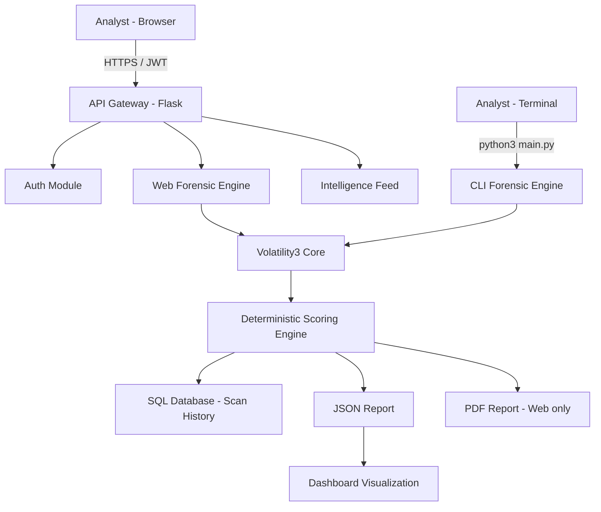
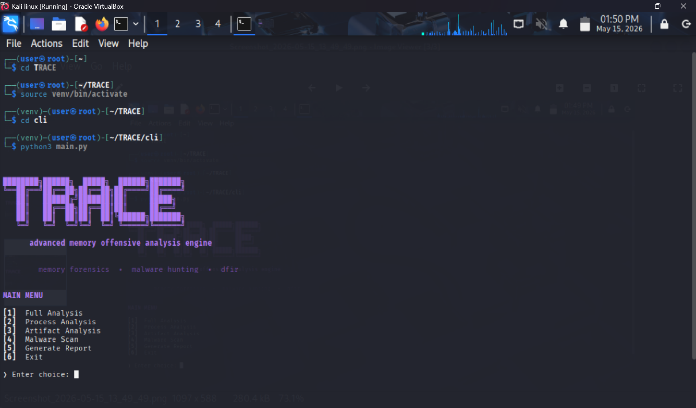

# TRACE – Memory Forensics & Threat Intelligence Platform


[](https://reactjs.org/)
[](https://flask.palletsprojects.com/)
[](https://www.python.org/)
[](https://volatility3.readthedocs.io/)
[](https://github.com/Sreyan-py/TRACE-Memory-Forensics)

> **TRACE** is a hybrid CLI and web-based Memory Forensics & Threat Analysis Framework that automates digital forensic investigations using Volatility3. It detects suspicious processes, malware indicators, forensic artifacts, injected memory regions, and system anomalies from memory dump files — through both a terminal forensic engine and a modern browser-based SOC dashboard.

---

## 🛡️ Project Overview

Traditional memory forensic investigations require analysts to manually execute multiple Volatility commands and interpret raw outputs, making investigations time-consuming and complex. TRACE addresses this by integrating automated forensic workflows, threat scoring, report generation, and visualization into a single unified platform.

It operates on two fronts:

- **CLI Forensic Engine**: Terminal-first memory analysis — process inspection, malware detection, artifact analysis, threat scoring, and JSON report generation. Optimized for large memory dumps, offline investigations, and advanced forensic workflows. Runs without the web stack.
- **Elite SOC Web Platform**: Browser-based interaction with dashboard visualization, memory dump uploads, forensic report viewing, and scan history tracking.

Both interfaces share the same Volatility3 analysis core and deterministic scoring engine, guaranteeing consistent results regardless of interface.

---

## 👥 Team TRACE

### [Sreyan Swarna](https://github.com/Sreyan-py)
**Role: Platform Architect & Lead Full-Stack Engineer**
- **Frontend Engineering**: Developed the entire "Elite SOC" UI/UX using React and Tailwind CSS.
- **Backend Integration**: Architected the modular Flask API and blueprint system.
- **Platform Architecture**: Designed the end-to-end data flow and deployment strategy.
- **Security Systems**: Implemented the JWT-based authentication and Analyst Identity/Rank system.
- **Module Implementation**: Built the Threat Intel Center, Malware Lab, and Real-time Dashboard widgets.

### [Sunanda Bandi](https://github.com/SunandaBandi)
**Role: Lead Forensic Tooling Engineer**
- **CLI Forensic Tooling**: Developed the core CLI (`cli/main.py`) for raw memory processing and terminal-based analysis.
- **Forensic Integration**: Managed the integration of Volatility3-based processing pipelines.
- **Backend Scan Utilities**: Engineered the scan logic and forensic utility functions.
- **Incident Response Logic**: Defined the detection patterns for suspicious processes and injected memory regions.
- **Threat Detection Pipeline**: Optimized backend data extraction from memory artifacts, including large dump handling.

---

## ✨ Features

| Feature | Web Platform | CLI Engine |
|---|:---:|:---:|
| Memory Dump Analysis (`.raw`, `.mem`, `.dmp`, `.img`, `.vmem`) | ✅ | ✅ |
| Deterministic Threat Scoring (LOW / MEDIUM / HIGH / CRITICAL) | ✅ | ✅ |
| Process Analysis & Suspicious Process Detection | ✅ | ✅ |
| Malware Detection (VAD, Injected Regions, Executable Pages) | ✅ | ✅ |
| Artifact Investigation (temp files, encoded commands, shell traces) | ✅ | ✅ |
| JSON Report Generation | ✅ | ✅ |
| Windows & Linux Memory Dump Support | ✅ | ✅ |
| PDF Forensic Report | ✅ | — |
| Real-time SOC Dashboard | ✅ | — |
| Scan History & Threat Visualization | ✅ | — |
| Analyst Rank System | ✅ | — |
| Zero-dependency Terminal Mode | — | ✅ |
| Large Memory Dump Analysis (200MB+) | — | ✅ |
| Cyber-Themed Terminal Interface | — | ✅ |

---

## 🔬 CLI Forensic Engine

The CLI is the technical backbone of TRACE. It runs entirely in the terminal without requiring the web stack — making it ideal for headless environments, rapid field triage, and direct Volatility3 workflows. For memory dumps above 200MB, the CLI engine is the recommended interface for improved stability and performance.

### Running the CLI

```bash
cd cli
python3 main.py
```

### Analysis Pipeline

```
[1] Memory Artifact Ingestion
      └── Accepts .raw / .dmp / .mem / .img / .vmem files
      └── Auto-detects OS (Windows / Linux)
      └── Optimized for large dumps (200MB+)

[2] Volatility3 Plugin Execution
      └── windows.pslist / linux.pslist   — Process enumeration
      └── windows.malfind / linux.malfind — Injected code regions
      └── Artifact and VAD inspection

[3] Process Analysis
      └── Identifies suspicious processes:
          powershell.exe, cmd.exe, mimikatz.exe, dumpit.exe, winrar.exe

[4] Artifact Analysis
      └── Temporary file usage
      └── Encoded PowerShell commands
      └── Suspicious shell execution
      └── Malware staging indicators

[5] Malware Detection
      └── PAGE_EXECUTE_READWRITE regions
      └── VadS unbacked memory entries
      └── Injected PE signatures

[6] Threat Scoring
      └── Dynamic scoring based on:
          suspicious process count + malware indicators + artifact findings
      └── Levels: LOW → MEDIUM → HIGH → CRITICAL

[7] Report Generation
      └── JSON forensic report → report_<timestamp>.json
      └── Human-readable summary in terminal
```

---

## 🛠️ Tech Stack

### Frontend
- **React 19**: Modern component-based architecture.
- **Tailwind CSS v4**: Advanced utility-first styling with custom cyber-palettes.
- **Recharts**: High-performance data visualization for threat telemetry.
- **Lucide React**: Enterprise-grade iconography.

### Backend
- **Flask (Python)**: Modular API server with blueprint-based routing.
- **Flask-CORS**: Cross-origin resource sharing for frontend integration.
- **Werkzeug**: WSGI utility layer for request handling.
- **SQLAlchemy**: Robust ORM for user identity and scan history management.
- **ReportLab**: Dynamic PDF generation for investigative documentation.

### CLI Engine
- **Python 3**: Core forensic runner (`cli/main.py`).
- **JSON**: Structured report output for downstream tooling.

### Cybersecurity Core
- **Volatility3**: Industry-standard memory analysis framework.
- **SHA256 Hashing**: Integrity-first artifact identification.
- **OS-aware Plugin Selection**: Automatically selects Windows or Linux plugins.
- **Deterministic Scoring**: Logic-based threat assessment with no randomness.

### Development Environment
- **Kali Linux**: Primary development and testing platform.
- **VS Code**: Development environment.
- **Python venv**: Dependency isolation.

---

## 🏗️ System Architecture



---

## ⚙️ Installation & Setup

### Prerequisites
- Python 3.9+
- Node.js 18+
- Volatility3 installed and on `PATH`
- Kali Linux or any Debian-based system recommended

### 1. Clone the Repository
```bash
git clone https://github.com/Sreyan-py/TRACE-Memory-Forensics.git
cd TRACE-Memory-Forensics
```

### 2. CLI Engine (Standalone — no web stack required)
```bash
cd cli
python -m venv venv
source venv/bin/activate
pip install -r requirements.txt
python3 main.py
```

### 3. Backend Setup
```bash
cd backend
python -m venv venv
source venv/bin/activate
pip install -r requirements.txt
python scripts/seed_db.py
python app.py
```

### 4. Frontend Setup
```bash
cd frontend
npm install
npm run dev
```

---

## 🚀 Deployment Guide

### 1. Backend (Render)
- **Service Type**: `Web Service`
- **Build Command**: `pip install -r backend/requirements.txt`
- **Start Command**: `gunicorn backend.app:app`
- **Environment Variables**:
  - `PORT`: `5001`
  - `FLASK_ENV`: `production`
  - `DATABASE_URL`: PostgreSQL connection string from Render
  - `SECRET_KEY`: Your secure key

### 2. Frontend (Vercel)
- **Framework Preset**: `Vite`
- **Root Directory**: `frontend`
- **Environment Variables**:
  - `VITE_API_URL`: Your Render backend URL (e.g. `https://trace-api.onrender.com`)

### 3. Database (PostgreSQL)
The local SQLite database resets on every Render deploy. Use Render's managed PostgreSQL instead:
1. Create a **Render PostgreSQL** instance.
2. Copy the **Internal Database URL**.
3. Set it as `DATABASE_URL` in your backend environment variables.
4. TRACE will automatically migrate the schema on next startup.

---

## 🔬 Deterministic Engine

TRACE eliminates the "black box" problem in threat scoring. The same memory dump will always produce the same forensic result — across both interfaces.

- **Reproducibility**: Peer-reviewable, consistent forensic findings.
- **Efficiency**: Instant results for previously analyzed artifacts via hash cache.
- **Auditability**: Clear mapping between detected indicators and threat scores.
- **Consistency**: CLI and web produce identical scores for identical inputs.

---

## 📸 Screenshots

### Elite SOC Dashboard


---

### TRACE CLI Forensic Engine


---

## ⚠️ Limitations

- Requires valid memory dump files in supported formats.
- Depends on Volatility3 plugin compatibility.
- Limited real-time monitoring support.
- IOC detection is currently limited.

---

## 🔮 Future Enhancements

- **IOC Detection Engine**: Indicator of Compromise matching against known threat databases.
- **MITRE ATT&CK Mapping**: Technique tagging for all detected indicators.
- **DLL Analysis**: Deep inspection of loaded and injected DLLs.
- **YARA Rule Integration**: Custom signature-based malware detection.
- **AI-Based Threat Detection**: Neural-network assisted malware family classification.
- **Threat Intelligence APIs**: Live feed integration for enriched context.
- **Live SIEM Integration**: Direct ingestion from Splunk and ELK stacks.
- **Distributed Scan Nodes**: Parallelized processing for massive memory dumps.
- **Real-time Monitoring**: Continuous memory stream analysis.
- **Multi-user Collaboration**: Simultaneous multi-analyst investigation rooms.

---

**TRACE — Stabilizing the future of Digital Forensics.**
